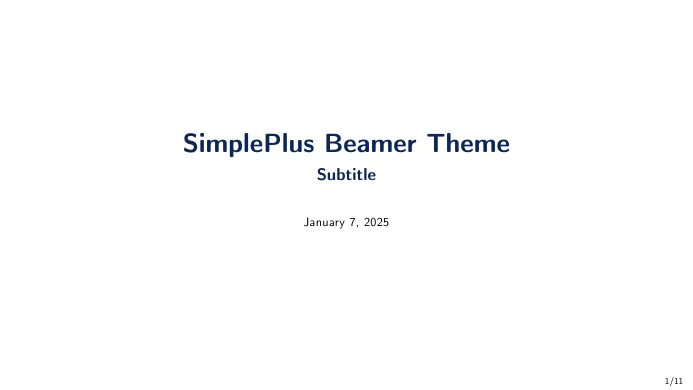
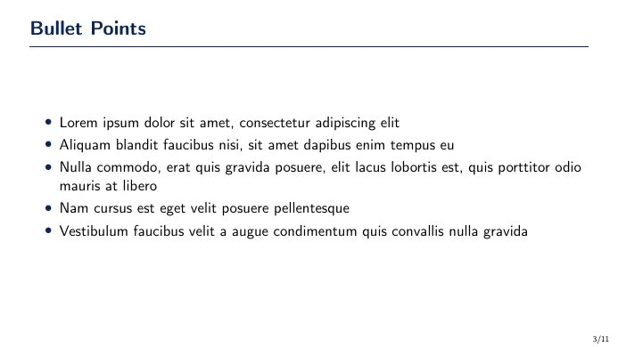
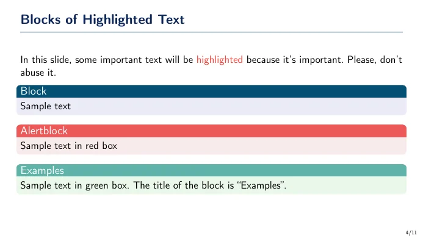
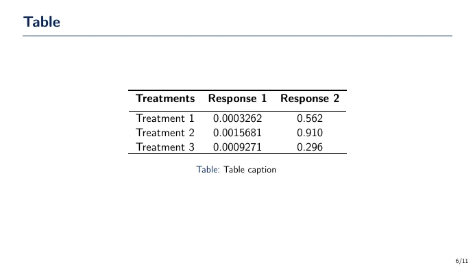

# 🍁 SimplePlus Typst

**SimplePlus Typst** is a minimalist Typst presentation theme based on the [SimplePlus Beamer Theme](https://github.com/pm25/SimplePlus-BeamerTheme). It recreates the original's navy headings, thin title rule, rounded blocks, circular bullets, and Computer Modern typography in a 16:9 layout. [Polylux](https://typst.app/universe/package/polylux/) provides slides and overlays.

- Original LaTeX theme: [SimplePlus Beamer Theme](https://github.com/pm25/SimplePlus-BeamerTheme)
- Complete Typst example: [demo.typ](demo.typ)
- Built example: [demo.pdf](demo.pdf)

## Preview

Below are a few slides from the Typst example:






## Build

Install [Typst](https://typst.app/) and run this command from the folder:

```sh
./build.sh
```

The script builds `demo.pdf` and loads the bundled CMU fonts. Typst may download Polylux on the first build. To compile another deck, use `typst compile --font-path fonts your-slides.typ your-slides.pdf`.

## Use the theme

```typst
#import "simpleplus.typ": *
#show: simpleplus

#title-slide([My talk], subtitle: [A short subtitle], date: [September 2026])

#frame([Main result])[
  - First point
  - Second point

  #standard-block([Key idea], [A short explanation.])
]

#closing[Thank you]
```

`frame` centers its content vertically, like the original Beamer frames. Use `vertical: top` for dense slides. The theme also provides `overview`, `alert-block`, `example-block`, and `theorem`. Regular Typst tables, figures, equations, grids, and citations work inside frames; Polylux provides overlays.

The original PDF uses Computer Modern Sans Serif. This port bundles the [CMU OpenType version](https://ctan.org/pkg/cm-unicode) for text and typewriter content and uses New Computer Modern Math for list markers. Pass `--font-path fonts` when compiling directly so Typst can find the bundled fonts.

## License

The Typst theme, example, and project assets are released under the [MIT License](LICENSE). The original SimplePlus theme is [Unlicensed](https://github.com/pm25/SimplePlus-BeamerTheme/blob/master/LICENSE). The bundled CMU fonts retain their separate [SIL Open Font License](fonts/OFL.txt).
